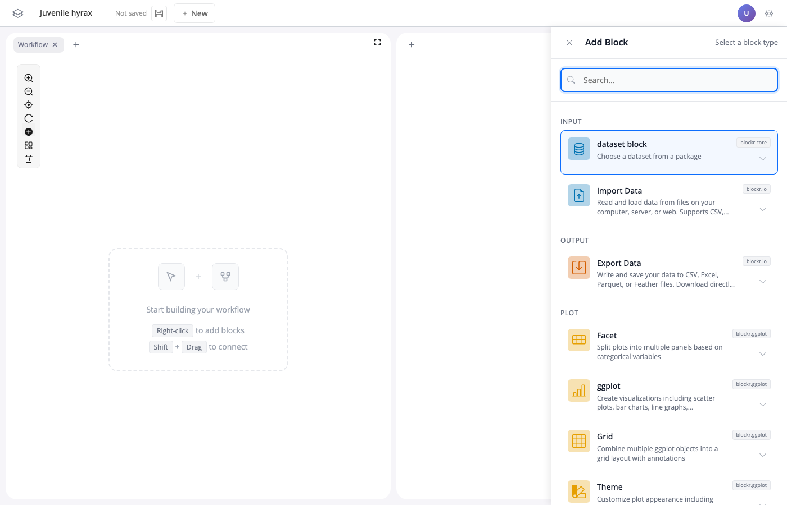

# Sidebar — Design

This documents the UI design as implemented in the prototype (`blockr.dock@feat/sidebar-s3-dispatch`, deployed at https://blockr.cloud/app/empty). The visual design is validated and should be preserved. For exact CSS and layout details, refer to the prototype.

## Visual design

Replicate the look and feel of the prototype. The CSS can be taken from the prototype's stylesheet directly. Screenshots below show the target.

## Key UI behaviors

- Sidebar slides in from the right, board remains visible and interactive behind it
- Content swaps dynamically: block cards for browsing, collapsible sections for settings, multi-select cards for stacks
- Block cards support two interaction modes: click to quick-add, chevron to expand accordion with detailed options (name, ID, input selection)
- Search filters across block name, description, category, and package — hides empty categories
- Keyboard navigation: arrow keys between cards, Enter to confirm, Escape to close

## Open questions for implementation

- Should this live in blockr.dock or become a separate package?
- How does the sidebar integrate with the existing action/plugin system?
- What's the right extensibility mechanism for custom sidebar content types?
